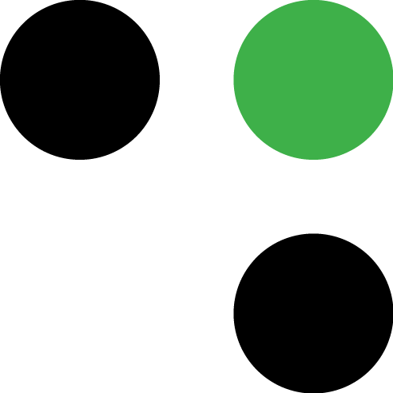

<h1 align="center">
  <br>
  
  <br>
  Grey Matter UI Component Library
  <br>
</h1>

<h4 align="center">React components for Grey Matter user interfaces</h4>

<p align="center">
  <a href="https://github.com/prettier/prettier" target="_blank">
    
  </a>
  <a href="https://www.styled-components.com/" target="_blank"></a>
  <a href="https://circleci.com/gh/DecipherNow/gm-ui-components/tree/master" target="_blank"></a>
  <a href="https://codeclimate.com/github/DecipherNow/gm-ui-components/maintainability"></a>
  <a href="https://codeclimate.com/github/DecipherNow/gm-ui-components/test_coverage"></a>
  <a href="https://opensource.org/licenses/mit-license.php" target="_blank"></a>
  <a href="https://david-dm.org/deciphernow/gm-ui-components" target="_blank"></a>
</p>

<p align="center">
  <a href="#installation">Installation</a> •
  <a href="#usage">Usage</a> •
  <a href="#documentation">Documentation</a> •
  <a href="#compatability">Compatability</a> •
  <a href="#related-projects">Related Projects</a> •
  <a href="#license">License</a>
</p>

## Installation

gm-ui-components is available as an npm package:

```
npm install --save gm-ui-components
```

## Usage
An example using the Icon component:

```
import React from 'react';
import { render } from 'react-dom';
import { Icon } from 'gm-ui-components';

function App() {
  return (
    <Icon
        backgroundStyle="BackgroundSquareRounded"
        backgroundColor="#000"
        glyphColor="#fff"
        glyph="Bell"
    />
  );
}

render(<App />, document.querySelector('#app'));
```
## Documentation

See the [Grey Matter UI Components storybook](https://deciphernow.github.io/gm-ui-components) for more usage examples and documentation.

## Compatability

* Chrome 61 +
* Firefox 56 +
* Safari 10.1 +
* IE 11 +


## Related Projects

* [Grey Matter Fabric JVM SDK](https://github.com/DecipherNow/gm-fabric-jvm)
* [Grey Matter Fabric Go SDK](https://github.com/DecipherNow/gm-fabric-go)
* [Grey Matter Fabric Passthrough Agent](https://github.com/DecipherNow/gm-fabric-jvmagent)

## License

MIT
